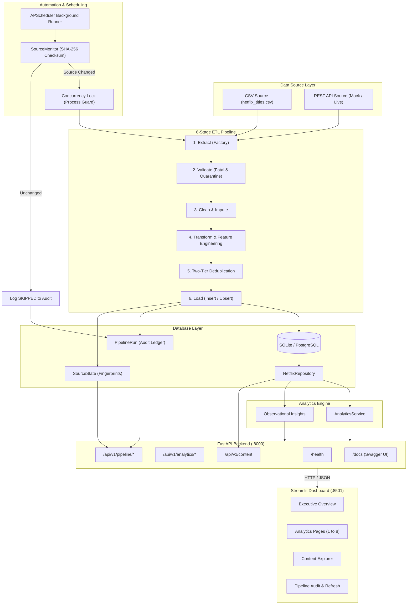

# 🎬 Netflix Live Content Analytics Platform

[](https://www.python.org/)
[](https://fastapi.tiangolo.com/)
[](https://streamlit.io/)
[](https://www.sqlalchemy.org/)
[](https://www.docker.com/)
[](docs/testing.md)
[](LICENSE)

> An automated, production-grade full-stack data analytics and intelligence platform for entertainment content catalogs. Features automated 6-stage idempotent ETL ingestion, SHA-256 source change detection, relational database storage, a high-performance FastAPI REST backend, and an interactive Netflix-themed Streamlit analytics dashboard.

---

## 📌 Project Overview

The **Netflix Live Content Analytics Platform** transforms a static exploratory data analysis project into an enterprise-ready, automated data analytics platform. Rather than relying on one-off Jupyter notebooks that quickly become obsolete as catalogs evolve, this platform provides an autonomous, end-to-end data lifecycle:

1. **Monitors & Fingerprints**: Inspects upstream data sources (CSV/API) using streaming **SHA-256 cryptographic checksums** to detect updates.
2. **Validates & Quarantines**: Enforces strict schema integrity, isolating anomalous records without crashing pipelines.
3. **Cleans & Engineers**: Standardizes text, imputes missingness, and derives 19 analytical features (demographic tiers, runtime tiers, licensing latency).
4. **Deduplicates Idempotently**: Employs two-tier collision resolution (in-batch Level A and database Level B) supporting both append-only and upsert modes with zero duplicate creation.
5. **Persists & Audits**: Commits records to relational storage (SQLite/PostgreSQL) while logging execution durations and counts to an immutable audit ledger.
6. **Analyzes & Exposes**: Computes descriptive statistics and observational insights exposed via a sub-15ms **FastAPI REST API**.
7. **Presents Interactively**: Delivers a rich, multi-page **Streamlit Dashboard** featuring dynamic Plotly visualizations and catalog exploration.
8. **Runs Portably**: Containerized into a multi-service **Docker Compose** stack with persistent volume storage and self-healing healthchecks.

---

## 🎯 Key Features

### 🛠️ Data Engineering & ETL Pipeline
* **Configurable Sources**: Pluggable `CSVDataSource` and `APIDataSource` unified via `DataSourceFactory`.
* **Idempotent 6-Stage Pipeline**: Extract, Validate, Clean, Transform, Deduplicate, and Load.
* **Row-Level Anomaly Quarantine**: Isolate malformed rows into quarantine logs without disrupting valid catalog titles.
* **19 Engineered Derivative Features**: Calculates theatrical-to-platform licensing lag, 5 runtime duration tiers, 5-tier audience age groups, and multi-country production flags.
* **Two-Tier Deduplication**: In-batch internal deduplication alongside relational database collision partitioning.
* **Flexible Ingestion Modes**: Supports `insert_new_only` (rapid append) and `upsert` (metadata update).

### 🗄️ Relational Database Layer
* **SQLAlchemy 2.0 ORM**: Fully typed models with index optimization across `show_id`, `type`, `release_year`, `rating`, and countries.
* **Dual Database Compatibility**: Native SQLite storage for local portability with zero-code PostgreSQL readiness.
* **Repository Pattern**: Centralized `NetflixRepository` handling parameterized SQL queries and transactional batching with automated rollback safety.

### 📊 Analytics & Insights Engine
* **Multivariate Catalog Analysis**: Formats, top genres, country footprints, maturity ratings, and runtime characteristics.
* **Audience Demographics**: 5-tier classification (`Adults 18+`, `Teens 13-17`, `Older Kids 7-12`, `Little Kids 0-6`, `Unrated`).
* **Evidence-Based Insights**: Deterministic, rule-based observational business intelligence engine generating factual catalog statements.
* **Multi-Dimensional Query Filtering**: Dynamic filtering by content type, year range, genre, country, and rating.

### ⚡ RESTful API Backend (FastAPI)
* **High Performance**: Sub-15ms cached response times with automatic Pydantic request/response validation.
* **Comprehensive Endpoint Suite**: Health checks, aggregated dashboard summaries, domain analytics, and paginated content exploration.
* **Full-Text Catalog Search**: SQL-powered multi-column search across title, director, and cast.
* **Interactive Documentation**: Auto-generated Swagger UI (`/docs`) and ReDoc (`/redoc`).

### 🎬 Interactive Streamlit Dashboard
* **Netflix Dark Design Aesthetic**: Curated palette (`#141414` background, `#1F1F1F` cards, `#E50914` signature red accent).
* **Multi-Page Experience**: Executive Overview, Content Analysis, Temporal Trends, Geographic Footprint, Ratings & Demographics, Duration & Longevity, Content Explorer, and Data Management.
* **Decoupled Architecture**: Frontend queries backend via HTTP `ApiClient`, avoiding direct database locks.
* **Global Persistent Sidebar Filters**: Filter state persists seamlessly across all dashboard pages with a 1-click reset.

### ⏱️ Automation, Scheduling & Monitoring
* **Background Scheduler**: Integrated `APScheduler` executing non-blocking interval syncs.
* **Cryptographic Change Detection**: SHA-256 fingerprinting skips heavy ETL operations when source data is unchanged.
* **Persistent Audit Ledger**: Tracks every execution run (`RUNNING`, `SUCCESS`, `SKIPPED`, `FAILED`, `PARTIAL_SUCCESS`) with durations and row metrics.
* **Concurrency Guard**: Thread-level process locks reject conflicting triggers (`HTTP 409 Conflict`).

### 🐳 Deployment & Production Readiness
* **Containerized Architecture**: Multi-service `docker-compose.yml` coordinating FastAPI and Streamlit.
* **Volume Persistence**: Named volumes (`netflix_data`, `netflix_logs`) preserve SQLite databases across container lifecycles.
* **Container Health Probes**: Native healthchecks ensure proper service startup sequencing.
* **Structured Logging**: Automatic dispatch to `application.log`, `pipeline.log`, and `scheduler.log`.

---

## 🏛️ System Architecture



*For detailed architectural layer specifications, read [`docs/architecture.md`](docs/architecture.md).*

---

## 🔄 End-to-End Data Flow

The lifecycle of a catalog record flows through a deterministic 16-stage pipeline:

```text
Raw CSV / API Data
        ↓
Data Source Factory (Capture Extraction Timestamp & File Metadata)
        ↓
Schema Validation (Fatal Schema Check / Row Anomaly Quarantine)
        ↓
Text Cleaning & Whitespace Normalization (Null Imputation)
        ↓
Feature Engineering (Derive 19 features: lag, age_group, duration_min, tiers)
        ↓
Level A Deduplication (In-batch title + type + release_year collisions)
        ↓
Level B Deduplication (Database show_id collision check: New vs Existing)
        ↓
Transactional Ingestion (Mode: 'insert_new_only' or 'upsert')
        ↓
Relational Database Commit (Rollback on exception)
        ↓
Analytics Engine (SQL multi-criteria dynamic aggregation)
        ↓
FastAPI Backend (Pydantic serialization & sub-15ms caching)
        ↓
Streamlit Dashboard (Interactive Plotly dark visualizations)
```

*For complete lifecycle details and error handling, consult [`docs/data_flow.md`](docs/data_flow.md).*

---

## 💻 Technology Stack

| Category | Technology | Purpose |
| :--- | :--- | :--- |
| **Language** | [Python 3.10+](https://www.python.org/) | Core language across all platform layers |
| **Data Processing** | [Pandas 2.0+](https://pandas.pydata.org/), [NumPy](https://numpy.org/) | Ingestion, feature engineering, and statistical modeling |
| **Database & ORM** | [SQLite](https://www.sqlite.org/), [SQLAlchemy 2.0+](https://www.sqlalchemy.org/) | Relational storage, schema migrations, and connection pooling |
| **Backend API** | [FastAPI](https://fastapi.tiangolo.com/), [Pydantic 2.0+](https://docs.pydantic.dev/) | RESTful API endpoints, request validation, and OpenAPI specs |
| **ASGI Web Server** | [Uvicorn](https://www.uvicorn.org/) | High-performance asynchronous production ASGI web server |
| **Frontend UI** | [Streamlit](https://streamlit.io/) | Multi-page interactive analytical web dashboard |
| **Visualization** | [Plotly](https://plotly.com/python/), [Matplotlib](https://matplotlib.org/), [Seaborn](https://seaborn.pydata.org/) | Interactive dark mode charts and publication-grade static exports |
| **Automation** | [APScheduler 3.10+](https://apscheduler.readthedocs.io/) | Background job scheduling and periodic catalog ingestion |
| **Testing** | [Pytest 7.0+](https://pytest.org/), [HTTPX](https://www.python-httpx.org/) | Automated unit, integration, and API testing (50 tests) |
| **Containerization**| [Docker](https://www.docker.com/), [Docker Compose](https://docs.docker.com/compose/) | Multi-container image packaging and persistent volume management |
| **Config & Logging**| [Python-Dotenv](https://github.com/theskumar/python-dotenv), Logging | Centralized settings, multi-environment configs, and dedicated loggers |

---

## 📂 Project Structure

```text
Netflix Shows and Movies/
├── analytics/                      # Database-driven Analytics Engine
│   ├── analytics_service.py        # Central analytics facade
│   ├── content_analysis.py         # Format and genre analyzers
│   ├── duration_analysis.py        # Film runtimes and season longevity
│   ├── geographic_analysis.py      # Territory rankings & co-productions
│   ├── insights.py                 # Evidence-based business insights generator
│   ├── overview.py                 # High-level catalog KPIs
│   ├── rating_analysis.py          # Maturity ratings & 5-tier demographics
│   └── temporal_analysis.py        # Yearly trajectories & seasonality
├── api/                            # FastAPI REST Backend Service
│   ├── dependencies.py             # Database and service dependency injection
│   ├── main.py                     # App entrypoint, CORS, lifespan context manager
│   ├── routes/                     # REST Route Handlers
│   │   ├── analytics.py            # Aggregated summary & domain metrics
│   │   ├── content.py              # Paginated catalog browsing & search
│   │   ├── health.py               # System health & database probes
│   │   └── pipeline.py             # Ingestion status, refresh & audit history
│   └── schemas/                    # Pydantic Request/Response Data Contracts
├── automation/                     # Scheduling & Ingestion Automation
│   ├── jobs.py                     # Concurrency-guarded execution wrapper
│   ├── pipeline_monitor.py         # Audit ledger tracking & persistence
│   ├── scheduler.py                # APScheduler lifecycle manager
│   └── source_monitor.py           # SHA-256 checksum & change detector
├── config/                         # Central Configuration & Logging
│   ├── logging_config.py           # Structured production logging setup
│   └── settings.py                 # Multi-environment parameters & paths
├── dashboard/                      # Interactive Streamlit Web UI
│   ├── app.py                      # Executive Overview landing page
│   ├── components/                 # Reusable UI presentation components
│   │   ├── api_client.py           # Decoupled HTTP API client
│   │   ├── charts.py               # Reusable Plotly dark chart constructors
│   │   ├── filters.py              # Persistent global sidebar filters
│   │   ├── metrics.py              # KPI card row and freshness banners
│   │   └── styling.py              # Netflix custom dark mode CSS
│   └── pages/                      # Multi-Page Dashboard Views
│       ├── 1_Overview.py           # Executive catalog summary
│       ├── 2_Content_Analysis.py   # Formats & genre specializations
│       ├── 3_Temporal_Trends.py    # Additions, release trends & seasonality
│       ├── 4_Geographic_Analysis.py# Interactive world map & co-productions
│       ├── 5_Ratings_and_Audience.py# Maturity codes & demographic tiers
│       ├── 6_Duration_Analysis.py  # Runtime percentiles & TV longevity
│       ├── 7_Content_Explorer.py   # Full-text search & title inspector
│       └── 8_Data_Management.py    # Live scheduler status & audit ledger
├── database/                       # Relational Persistence Layer
│   ├── database.py                 # Engine, SessionLocal, init_db()
│   ├── models.py                   # ORM Entities (Catalog, Runs, State)
│   └── repository.py               # Parameterized SQL repository
├── docs/                           # Comprehensive Engineering Documentation
│   ├── api_guide.md                # REST API endpoint reference
│   ├── architecture.md             # 10-layer architectural guide
│   ├── data_flow.md                # 16-stage record lifecycle specification
│   ├── docker_deployment.md        # Container setup & operations guide
│   ├── installation.md             # Step-by-step local developer setup
│   ├── portfolio_description.md    # Resume & portfolio project descriptions
│   ├── presentation_summary.md     # SIH / project defense briefing
│   ├── screenshots_guide.md        # Visual asset catalog & capture checklist
│   ├── testing.md                  # Test suite verification documentation
│   └── workflow.md                 # Autonomous ingestion walkthrough
├── pipeline/                       # 6-Stage Automated ETL Pipeline
│   ├── clean_data.py               # Imputation & feature engineering
│   ├── deduplicate.py              # Two-tier collision deduplication
│   ├── fetch_data.py               # Extraction stage
│   ├── load_data.py                # Transactional database loader
│   ├── pipeline_runner.py          # Master pipeline orchestrator
│   ├── transform_data.py           # Standardization & ORM packaging
│   ├── validate_data.py            # Schema verification & row quarantine
│   └── data_sources/               # Extensible Data Source Adapters
├── src/                            # Legacy Static EDA Scripts (Preserved)
│   ├── data_cleaning.py            # Baseline cleaning script
│   ├── exploratory_analysis.py     # Statistical computation module
│   └── visualization.py            # 12 static PNG chart generators
├── tests/                          # Automated Pytest Test Suites (50 Tests)
├── data/                           # Catalog Data (netflix_titles.csv)
├── logs/                           # Dedicated application, pipeline & scheduler logs
├── visualizations/                 # 12 publication-grade static figures
├── Dockerfile.api                  # FastAPI production container definition
├── Dockerfile.dashboard            # Streamlit production container definition
├── docker-compose.yml              # Multi-service container orchestration stack
├── requirements.txt                # Python package dependency manifest
├── run_analysis.py                 # Master one-click static analysis pipeline
└── README.md                       # Project documentation root
```

---

## ⚡ Installation & Quick Start

### Prerequisites
* Python `3.10`, `3.11`, or `3.12+`
* Git
* Optional: Docker & Docker Compose

### Local Developer Setup
```bash
# 1. Clone the repository
git clone https://github.com/your-username/netflix-live-analytics.git
cd netflix-live-analytics

# 2. Create and activate a virtual environment
python -m venv venv
# On Windows:
venv\Scripts\activate
# On macOS/Linux:
source venv/bin/activate

# 3. Install dependencies
pip install --upgrade pip
pip install -r requirements.txt

# 4. Copy environment configuration
cp .env.example .env

# 5. Initialize database tables and run baseline ingestion
python -c "from database.database import init_db; init_db()"
python -c "from pipeline.pipeline_runner import run_pipeline; run_pipeline()"
```

*For complete step-by-step instructions, consult [`docs/installation.md`](docs/installation.md).*

---

## 🚀 Running the Application

### Running Locally (Without Docker)

Run the backend and frontend in separate terminals:

**Terminal 1: Launch FastAPI REST Backend**
```bash
uvicorn api.main:app --host 127.0.0.1 --port 8000 --reload
```

**Terminal 2: Launch Streamlit Web Dashboard**
```bash
streamlit run dashboard/app.py
```

### Running with Docker Compose (Recommended)
Launch the entire containerized platform in a single command:
```bash
docker compose up --build
```
To run in background (detached mode):
```bash
docker compose up -d --build
```

*For full container management instructions, consult [`docs/docker_deployment.md`](docs/docker_deployment.md).*

---

## 🌐 Service Access URLs

| Interface | URL | Description |
| :--- | :--- | :--- |
| **Streamlit Dashboard** | [`http://localhost:8501`](http://localhost:8501) | Full interactive Netflix dark-themed UI |
| **FastAPI Backend** | [`http://localhost:8000`](http://localhost:8000) | Live analytics REST API |
| **Swagger UI Docs** | [`http://localhost:8000/docs`](http://localhost:8000/docs) | Interactive OpenAPI testing console |
| **ReDoc UI Docs** | [`http://localhost:8000/redoc`](http://localhost:8000/redoc) | Alternative clean API documentation |
| **Health Check** | [`http://localhost:8000/health`](http://localhost:8000/health) | System health and database connectivity probe |

---

## 🧪 Automated Testing & Verification

The repository incorporates **50 automated unit and integration tests** verifying all layers:
```bash
python -m pytest tests/ -v
```

### Test Suite Summary
* `tests/test_database.py` (3 tests): Entity mappings, upsert logic, DataFrame retrieval.
* `tests/test_data_sources.py` (6 tests): CSV reading, streaming chunking, API mock ingestion.
* `tests/test_pipeline.py` (7 tests): Schema validation, row quarantine, 19 derived features, idempotency.
* `tests/test_incremental_hardening.py` (4 tests): Lifecycle scenarios, conflict resolution, transactional rollback.
* `tests/test_analytics.py` (9 tests): Statistical distributions, audience demographics, observational insights.
* `tests/test_api.py` (9 tests): Healthcheck, pagination, search, parameterized filtering.
* `tests/test_dashboard.py` (5 tests): API client queries, error handling, Plotly chart constructors.
* `tests/test_automation.py` (7 tests): SHA-256 fingerprinting, scheduler lifecycle, concurrency process locks.

### Backward Compatibility
Execute the legacy exploratory analysis script to confirm zero regressions:
```bash
python run_analysis.py
```
*(Runs in under 7 seconds, verifying all 12 publication-grade figures in `visualizations/` and updating `reports/insights.md`).*

*For complete testing documentation, read [`docs/testing.md`](docs/testing.md).*

---

## 🖼️ Visual Assets & UI Showcase

The dashboard features a curated Netflix dark aesthetic with responsive micro-interactions:

| View | Description |
| :--- | :--- |
| **Executive Overview** | High-level KPI cards, Movie vs TV donut chart, annual ingestion trajectory, top genres, and observational insights. |
| **Content & Genres** | Top 12 genres, format genre specializations, and multi-genre hybrid percentage breakdown. |
| **Temporal Dynamics** | Historical release years, monthly ingestion seasonality, and premiere-to-catalog licensing delay. |
| **Geographic Footprint** | Global interactive Plotly choropleth world map and international co-production ratios. |
| **Ratings & Demographics**| Maturity certifications cross-tabulated against formats and 5-tier audience demographic segments. |
| **Duration & Longevity** | Movie runtime distribution (97-minute sweet spot) and TV show seasons longevity analysis. |
| **Content Explorer** | Server-side paginated title browsing with keyword search across title, director, and cast. |
| **Data Management** | Scheduler operational status, live SHA-256 source fingerprint, on-demand refresh trigger, and audit history ledger. |

*(To capture or inspect screenshot procedures, consult [`docs/screenshots_guide.md`](docs/screenshots_guide.md)).*

---

## 🔮 Future Scope & Roadmap

* **Live Streaming Ingestion**: Integration with real-time streaming message queues (Kafka / AWS Kinesis) for instantaneous content updates.
* **Production PostgreSQL Staging**: Multi-replica database clusters with automated read-write connection pooling.
* **ML Recommendation Layer**: Collaborative filtering and content embedding vectors for similarity recommendations.
* **User Authentication & RBAC**: JWT-secured API routes and role-based access for catalog administrators.
* **Automated Data Quality Alerts**: Webhook alerts (Slack/Email) triggered on pipeline quarantine threshold breaches.
* **Continuous Integration (CI/CD)**: GitHub Actions workflows executing Pytest, Docker builds, and security scans on push.

---

## 🤝 Contributing

Contributions are welcome! Please follow these steps:
1. Fork the repository.
2. Create a feature branch (`git checkout -b feature/amazing-feature`).
3. Commit your changes (`git commit -m 'Add amazing feature'`).
4. Ensure all automated tests pass (`python -m pytest tests/ -v`).
5. Push to the branch (`git push origin feature/amazing-feature`).
6. Open a Pull Request.

---

## 📄 License

This project is licensed under the MIT License - see the [LICENSE](LICENSE) file for details.
