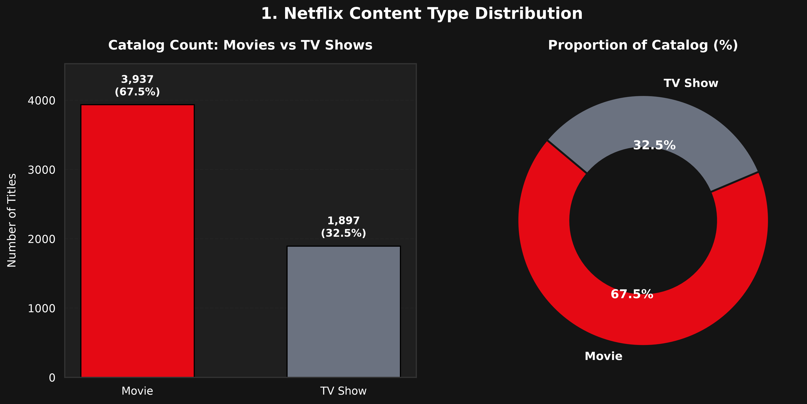
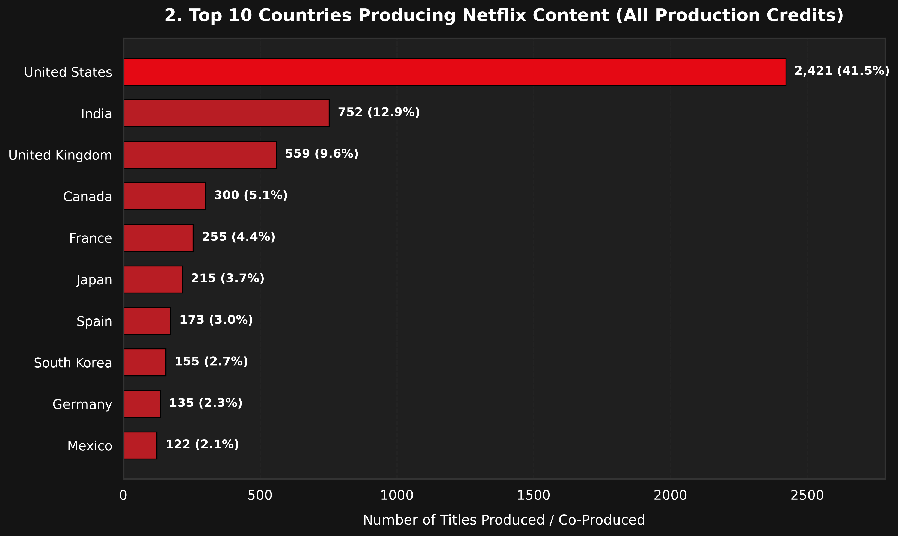
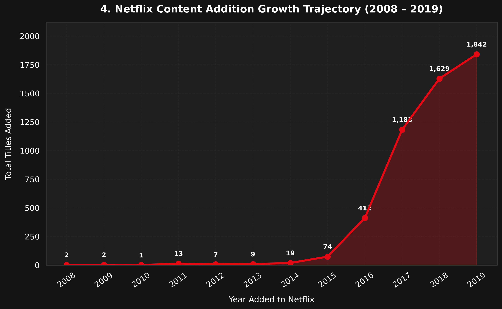
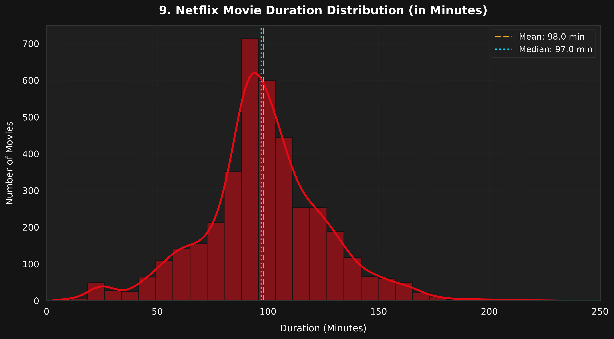
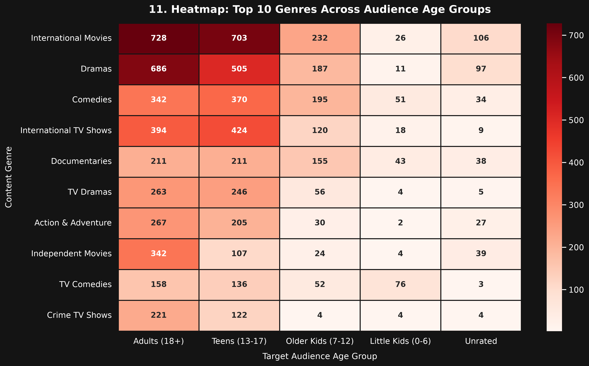
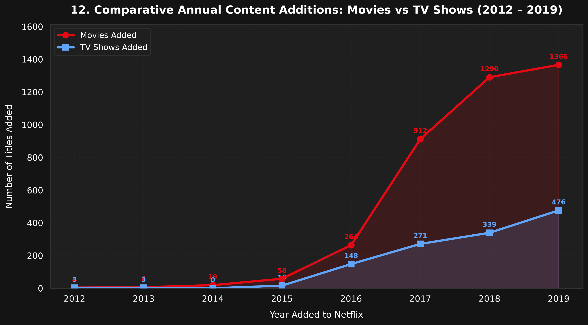

# 🎬 Netflix Movies & TV Shows Data Analysis

[](https://www.python.org/)
[](https://pandas.pydata.org/)
[](https://seaborn.pydata.org/)
[](https://matplotlib.org/)
[](https://jupyter.org/)
[](https://opensource.org/licenses/MIT)

> An end-to-end Data Analysis, Exploratory Data Analysis (EDA), Data Cleaning, Data Visualization, and Business Intelligence project exploring Netflix's global catalog of movies and television shows.

---

## 📌 Project Overview

This project conducts an exhaustive, publication-grade exploratory data analysis of the **Netflix content catalog** (comprising 5,830+ titles spanning 1925 to 2020). By combining modular Python processing pipelines with an interactive Jupyter notebook and high-resolution visualization suites, the project investigates content distribution, geographic production footprints, genre popularity, temporal addition trends, maturity ratings, and runtime characteristics.

**Core Philosophy**: Strictly focused on rigorous exploratory data analysis, data cleaning, statistical modeling, publication-quality visualizations, and actionable business insights. **No machine learning or artificial complexity.**

---

## 🎯 Objectives

The analysis systematically answers 12 core business and exploratory questions:

1. **Content Type Breakdown**: What is the proportion of Movies vs. TV Shows across the catalog?
2. **Geographic Dominance**: Which countries produce the highest volume of Netflix content?
3. **Genre Concentrations**: What are the most common genres and content categories?
4. **Temporal Trajectory**: How has Netflix content acquisition scaled from 2008 through 2019?
5. **Content Ingestion Seasonality**: What seasonal patterns govern monthly content additions?
6. **Maturity & Ratings**: Which ratings and demographic tiers dominate the platform?
7. **Prolific Directors**: Which directors have created the highest volume of titles?
8. **Leading Cast Members**: Which actors appear most frequently globally and in key regional markets?
9. **Movie Durations**: What is the statistical distribution of movie runtimes, and what are the outliers?
10. **TV Show Longevity**: How are TV show seasons distributed (single-season vs. multi-season)?
11. **Multi-Variate Heatmap**: How do top genres cluster across audience age groups?
12. **Comparative Growth**: How does the expansion trajectory of Movies compare to TV Shows over time?

---

## 📊 Dataset Description

The dataset reflects title metadata available in the Netflix library:

- **Total Records**: 5,837 raw records (5,834 after deduplication)
- **Time Span**: Original releases from **1925 to 2020**; Netflix additions from **2008 to 2019**
- **Catalog Breakdown**: 3,937 Movies (67.5%) and 1,897 TV Shows (32.5%)

### Column Schema
| Column | Description | Data Type | Notes |
| :--- | :--- | :--- | :--- |
| `show_id` | Unique title identifier | `int64` / `str` | Clean, non-null primary key |
| `title` | Title name | `str` | Sanitized text |
| `director` | Director name(s) | `str` | Multi-valued comma separated; 32.5% missing (imputed) |
| `cast` | Actor/actress names | `str` | Multi-valued comma separated; 9.5% missing (imputed) |
| `country` | Producing country/countries | `str` | Multi-valued comma separated; 7.3% missing (imputed) |
| `date_added`| Date title was added to Netflix | `datetime` | Standardized ISO format; extracted year, month, day |
| `release_year`| Original theatrical/broadcast premiere | `int64` | Range: 1925 – 2020 |
| `rating` | Content maturity certification | `str` | TV-MA, TV-14, R, PG-13, etc. |
| `duration` | Runtime or season count | `str` | Parsed into `duration_min` and `seasons` |
| `listed_in` | Content genres/categories | `str` | Multi-valued comma separated (42 unique genres) |
| `description`| Synopsis / plot premise | `str` | Clean text description |
| `type` | Content format (`Movie` or `TV Show`) | `str` | Primary categorical segment |

---

## 🛠️ Technologies Used

- **Language**: Python 3.10+
- **Data Manipulation**: [Pandas](https://pandas.pydata.org/), [NumPy](https://numpy.org/)
- **Data Visualization**: [Matplotlib](https://matplotlib.org/), [Seaborn](https://seaborn.pydata.org/)
- **Interactive Exploration**: [Jupyter Notebook](https://jupyter.org/)
- **Styling Architecture**: Custom dark-mode Netflix palette (`#E50914`, `#141414`, `#1F1F1F`, `#FFFFFF`)

---

## 📂 Project Structure

```
Netflix-Movies-Shows-Analysis/
├── data/
│   ├── netflix_titles.csv              # Raw Netflix dataset
│   └── netflix_cleaned.csv             # Cleaned, standardized, feature-engineered dataset
├── notebooks/
│   └── netflix_analysis.ipynb          # Complete, interactive exploratory Jupyter Notebook
├── src/
│   ├── __init__.py                     # Package initializer
│   ├── data_cleaning.py                # Data loading, deduplication, imputation & feature engineering
│   ├── exploratory_analysis.py         # Modular statistical calculations for EDA sections A through J
│   └── visualization.py                # Publication-quality dark-mode plotting suite (12 figures)
├── visualizations/                     # 12 high-resolution saved charts (300 DPI PNG)
│   ├── 01_movies_vs_tvshows.png
│   ├── 02_top10_countries.png
│   ├── 03_top10_genres.png
│   ├── 04_content_growth_over_years.png
│   ├── 05_monthly_content_additions.png
│   ├── 06_rating_distribution.png
│   ├── 07_top_directors.png
│   ├── 08_top_actors.png
│   ├── 09_movie_duration_distribution.png
│   ├── 10_tvshow_seasons_distribution.png
│   ├── 11_genre_rating_heatmap.png
│   └── 12_movies_vs_tvshows_growth.png
├── reports/
│   └── insights.md                     # Comprehensive business intelligence & strategy report
├── run_analysis.py                     # Master execution pipeline running full workflow
├── requirements.txt                    # Pinned Python package dependencies
├── .gitignore                          # Standard git ignore rules
└── README.md                           # Project documentation & portfolio showcase
```

---

## ⚡ Installation Instructions

1. **Clone the repository**:
   ```bash
   git clone https://github.com/your-username/netflix-movies-shows-analysis.git
   cd netflix-movies-shows-analysis
   ```

2. **Create and activate a virtual environment** (recommended):
   ```bash
   python -m venv venv
   # On Windows:
   venv\Scripts\activate
   # On macOS/Linux:
   source venv/bin/activate
   ```

3. **Install dependencies**:
   ```bash
   pip install -r requirements.txt
   ```

---

## 🚀 How to Run

### Option 1: Execute the End-to-End Pipeline in One Command
Run the master pipeline script to clean data, perform EDA, and generate all 12 publication-quality visualizations:
```bash
python run_analysis.py
```

### Option 2: Run Individual Modular Scripts
```bash
# 1. Clean raw data and generate data/netflix_cleaned.csv
python src/data_cleaning.py

# 2. Run exploratory statistical summaries
python src/exploratory_analysis.py

# 3. Generate and save all 12 charts to visualizations/
python src/visualization.py
```

### Option 3: Launch Interactive Jupyter Notebook
```bash
jupyter notebook notebooks/netflix_analysis.ipynb
```

---

## 💡 Key Business Insights

1. **Catalog Composition & Churn Defense**: Movies represent **67.5%** of the catalog, but TV series additions experienced an exponential **400%+ CAGR from 2015 to 2019**. Feature films attract initial sign-ups, while multi-season TV shows drive weekly subscriber retention and reduce customer churn.
2. **Global Production Hubs**: The **United States (41.5%)**, **India (12.9%)**, and the **United Kingdom (9.6%)** form the top producing triad. Over **14.5%** of titles are cross-border international co-productions, showcasing Netflix's global distribution efficiency.
3. **Mature Audience Skew**: **71.9%** of the catalog targets mature audiences (**40.7% Adults 18+** and **31.2% Teens 13–17**). Content for kids under 12 accounts for less than 24%, highlighting an acquisition opportunity for family-friendly animation to compete with Disney+.
4. **The 97-Minute Sweet Spot**: Movie runtimes exhibit a normal distribution with a median of **97.0 minutes** and an IQR between **85 and 113 minutes**. Consumers strongly favor ~95-minute home viewing experiences over 150+ minute theatrical epics.
5. **Seasonal Ingestion Spikes**: Content releases surge in **January (9.9%)**, **October (9.5%)**, **November (9.7%)**, and **December (8.7%)**, strategically synchronized with holiday vacation binges and Q4 marketing campaigns.

*For complete executive recommendations, read the full report in [`reports/insights.md`](reports/insights.md).*

---

## 🖼️ Visualizations Showcase

| Figure | Chart Preview & Description |
| :--- | :--- |
| **01. Movies vs TV Shows** | <br>*Catalog breakdown: 67.5% Movies vs 32.5% TV Shows.* |
| **02. Top 10 Countries** | <br>*US, India, and UK dominate global content production.* |
| **04. Content Growth** | <br>*Hyperbolic addition trajectory scaling rapidly from 2015 to 2019.* |
| **09. Movie Duration** | <br>*Histogram & KDE showing median runtime centered at 97.0 minutes.* |
| **11. Genre-Rating Heatmap** | <br>*Two-dimensional matrix cross-tabulating top genres across maturity ratings.* |
| **12. Comparative Growth** | <br>*Dual-line time series tracking Movie additions vs TV Show additions.* |

*(All 12 high-resolution charts are saved in the [`visualizations/`](visualizations/) directory).*

---

## 🔮 Future Improvements

- **Viewership Data Integration**: Merge with public streaming ratings (e.g., Nielsen streaming top 10, IMDb user ratings, Rotten Tomatoes tomato-meter scores) to correlate runtime and genre with audience satisfaction.
- **Interactive Dashboard**: Build an interactive Power BI or Streamlit dashboard enabling dynamic filtering by country, release year, and maturity rating.
- **NLP Metadata Enrichment**: Perform natural language topic modeling and sentiment analysis on plot `description` texts to discover emerging narrative motifs.
- **International Availability Tracking**: Track licensing expiration and regional geo-availability across worldwide Netflix regions.

---

## 📄 License

This project is licensed under the MIT License - see the [LICENSE](LICENSE) file for details.
"# NETFlIX_SHOWS_AND_MOVIED" 
